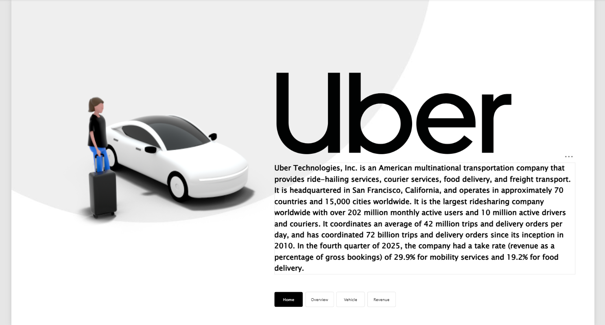
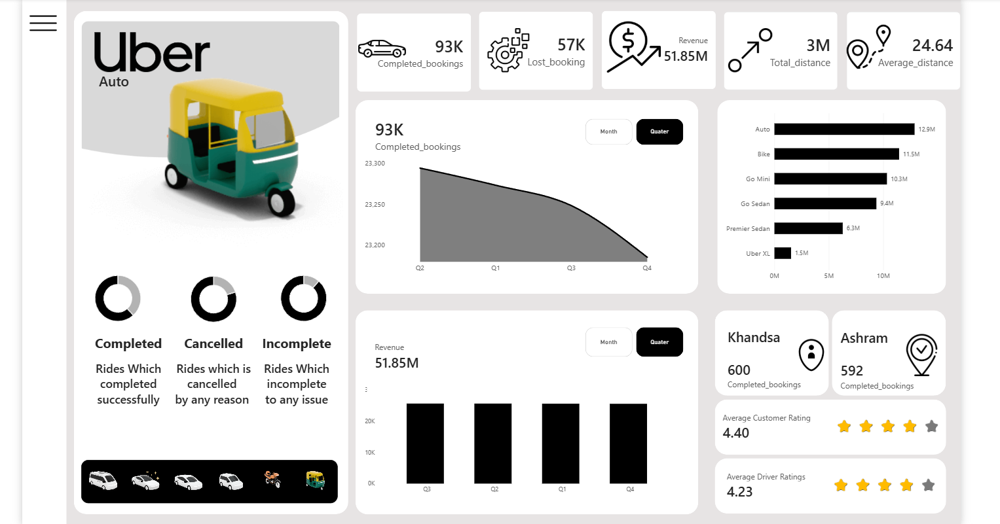
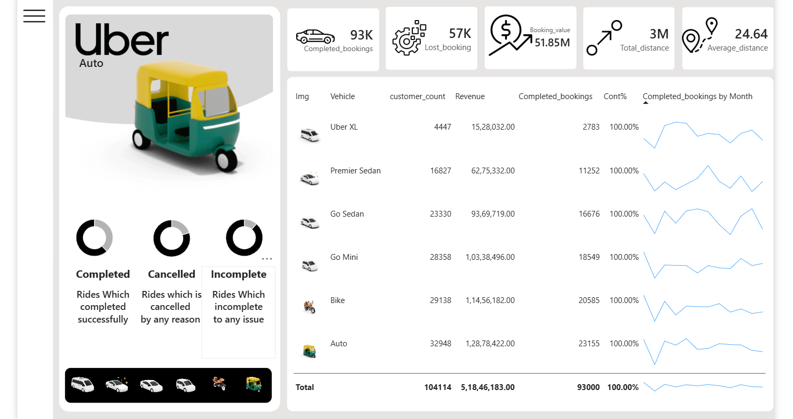
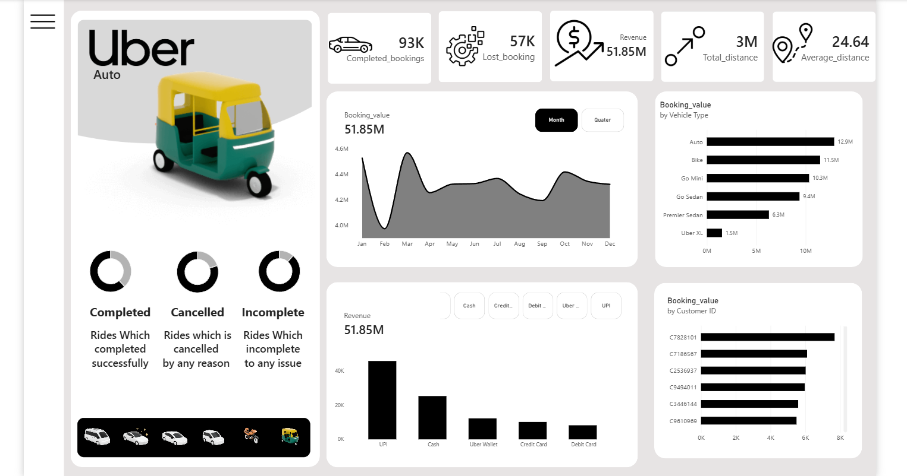

# 🚕 Uber Ride Analysis Dashboard

An interactive **Power BI dashboard** built to analyze Uber ride booking performance, booking value, vehicle performance, customer behavior, payment methods, ride status, and operational trends.

This project demonstrates how raw ride-booking data can be transformed into an interactive business intelligence dashboard using **Power BI, Power Query, and DAX**.

---

## 📊 Dashboard Preview

### 1. Overall Performance & Booking Analysis



This dashboard provides a high-level overview of Uber ride performance, including:

- Completed bookings
- Lost bookings
- Total booking value
- Total distance
- Average distance
- Quarterly booking trends
- Vehicle-wise booking value
- Location-wise booking performance
- Customer and driver ratings
- Booking status distribution

---

### 2. Vehicle Performance & Booking Analysis



This page compares different vehicle categories based on:

- Customer count
- Booking value
- Completed bookings
- Monthly booking trends
- Vehicle-level performance

### Vehicle Categories

- 🚗 Auto
- 🏍️ Bike
- 🚘 Go Mini
- 🚖 Go Sedan
- 🚙 Premier Sedan
- 🚐 Uber XL

---

### 3. Revenue & Booking Value Analysis



This page focuses on revenue and booking-value patterns, including:

- Monthly booking value trends
- Vehicle-wise booking value
- Customer-level booking value
- Vehicle performance comparison
- Revenue trends over time

---

### 4. Customer & Payment Analysis



This page analyzes:

- Payment method distribution
- Customer booking value
- Customer-level patterns
- Vehicle-wise performance
- Booking value trends

---

# 🎯 Project Objectives

The main objectives of this project were to:

- Analyze Uber ride booking performance.
- Understand completed, lost, cancelled, and incomplete bookings.
- Compare booking value across vehicle categories.
- Identify monthly and quarterly booking trends.
- Analyze customer and driver ratings.
- Understand payment method usage.
- Analyze location-wise booking performance.
- Compare vehicle categories based on business metrics.
- Build an interactive dashboard for business reporting.

---

# 📌 Key Dashboard Metrics

| KPI | Value |
|---|---:|
| Completed Bookings | **93K** |
| Lost Bookings | **57K** |
| Total Booking Value | **51.85M** |
| Total Distance | **3M** |
| Average Distance | **24.64** |
| Average Customer Rating | **4.40** |
| Average Driver Rating | **4.23** |

---

# 🔍 Key Insights

## 🚗 Vehicle Performance

The dashboard compares vehicle categories based on customer count, booking value, and completed bookings.

Among the displayed vehicle categories, **Auto has the highest booking value**, followed by Bike and Go Mini.

### Vehicle-wise Booking Value

| Vehicle | Booking Value |
|---|---:|
| Auto | **12.9M** |
| Bike | **11.5M** |
| Go Mini | **10.3M** |
| Go Sedan | **9.4M** |
| Premier Sedan | **6.3M** |
| Uber XL | **1.5M** |

---

## 💰 Booking Value

The dashboard tracks booking value across different time periods, vehicle categories, and customers.

This makes it possible to analyze:

- Revenue trends
- Vehicle contribution
- Customer-level booking value
- Monthly performance
- Quarterly performance

---

## 💳 Payment Methods

The payment analysis compares the major payment methods used for bookings.

The displayed payment categories include:

- UPI
- Cash
- Uber Wallet
- Credit Card
- Debit Card

UPI represents the highest-value payment category in the dashboard.

---

## 📈 Booking Trends

Monthly and quarterly visualizations are used to understand changes in booking activity over time.

These trends help analyze:

- Booking fluctuations
- Seasonal patterns
- Vehicle-level demand
- Overall operational performance

---

## ⭐ Ratings

The dashboard includes both customer and driver rating KPIs.

| Metric | Average |
|---|---:|
| Customer Rating | **4.40** |
| Driver Rating | **4.23** |

---

# 🛠️ Tools & Technologies

### Power BI

- Interactive dashboards
- KPI cards
- Data visualization
- Business intelligence reporting
- Trend analysis
- Interactive filtering

### Power Query

- Data cleaning
- Data transformation
- Data preparation
- Data preprocessing

### DAX

- Measures
- KPI calculations
- Aggregations
- Business metrics
- Analytical calculations

### Data Analysis

- Trend analysis
- Category comparison
- Customer analysis
- Performance analysis
- Exploratory data analysis

---

# 📊 Dashboard Pages

| Dashboard Page | Main Focus |
|---|---|
| **Overall Performance** | KPIs, booking status, trends and ratings |
| **Vehicle Analysis** | Vehicle-wise customers, bookings and booking value |
| **Revenue Analysis** | Booking value trends and vehicle/customer comparisons |
| **Customer & Payment Analysis** | Payment methods and customer-level analysis |

---

# 💡 Skills Demonstrated

- Data Analysis
- Data Cleaning
- Data Transformation
- Power BI
- Power Query
- DAX
- Dashboard Development
- KPI Design
- Data Visualization
- Business Intelligence
- Trend Analysis
- Customer Analysis
- Performance Analysis
- Exploratory Data Analysis

---

# 📁 Repository Structure

```text
Uber-/
│
├── Uber.pbix
│
├── bi-1.png
├── bi-2.png
├── bi-3.png
├── bi-4.png
│
└── README.md
